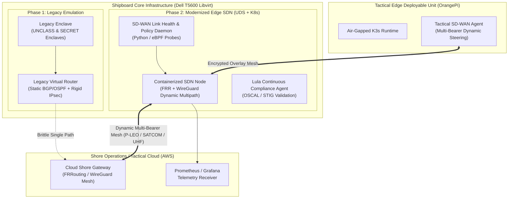

# Tactical Edge SD-WAN Modernization (Project Overmatch-Edge)

A reference architecture and proof-of-concept demonstrating the modernization of legacy shipboard/tactical network routing (e.g., ADNS/CANES legacy baselines) to a cloud-native, containerized **Software-Defined Networking (SD-WAN)** baseline.

Built for **Denied, Disrupted, Intermittent, and Limited (DDIL)** environments, packaged as air-gap OCI artifacts with **Zarf**, validated continuously against DISA STIGs using **Lula (OSCAL)**, and deployed across a hybrid multi-tier edge infrastructure (Dell Precision T5600 hypervisor, OrangePi tactical edge unit, and AWS Shore Gateway).

---

## 1. Architectural Overview



---

## 2. Key Capabilities Demonstrated

1. **Legacy to Modern Transition (ADNS / CANES Modernization):**
   - Emulating legacy static-routed, hardware/VM-bound architectures that drop sessions during link degradation.
   - Migrating network services into lightweight **Cloud-Native Network Functions (CNFs)** running inside containers.

2. **Dynamic Multi-Bearer Traffic Steering:**
   - Active monitoring of simulated tactical radio links (e.g., P-LEO Starlink/Sailor Edge, Military SATCOM, and Tactical Line-of-Sight RF).
   - Automated policy-based rerouting based on real-time latency, jitter, and packet loss without session teardown.

3. **Air-Gap Packaging & Zero-Trust Delivery:**
   - Declarative packaging of routing daemons, controllers, and configurations into **Zarf OCI packages** and **UDS bundles**.
   - Completely offline installation to tactical edge nodes (OrangePi & air-gapped Libvirt clusters).

4. **Continuous Compliance as Code (Lula & STIGs):**
   - Automated OSCAL compliance mapping against DISA STIGs (network security, rootless containers, secure sysctls).
   - Instant compliance evidence generation for IL4/IL5 accreditation and cATO readiness.

5. **Agentic AI-Assisted DevSecOps:**
   - AI-assisted codebase archaeology, automated regression test generation, and automated chaos/DDIL test harness creation.

---

## 3. Repository Structure

```
├── docs/
│   ├── adr/               # Architecture Decision Records
│   └── milestones/        # Implementation milestones and validation criteria
├── infra/
│   ├── tofu/              # OpenTofu / Libvirt network & VM topology
│   └── aws/               # Shore gateway Terraform / cloud configs
├── src/
│   ├── controller/        # Python / C++ SD-WAN link probe & policy daemon
│   └── dataplane/         # FRRouting, WireGuard configs, Dockerfile/CNF definitions
├── packages/
│   ├── zarf/              # Zarf air-gap package definitions (zarf.yaml)
│   └── uds/               # UDS Core bundle configuration (uds-bundle.yaml)
├── compliance/
│   └── lula/              # Lula OSCAL component definitions & STIG validation
├── tests/
│   ├── chaos/             # Linux tc / netem DDIL impairment generator
│   └── integration/       # End-to-end failover & regression test suites
└── scripts/               # Helper automation scripts
```

---

## 4. Hardware & Lab Setup

* **Dell Precision T5600:** Runs the nested Libvirt hypervisor, simulated multi-bearer network bridges, and shipboard core platform.
* **OrangePi 5 / SBC:** Deployed tactical edge node running K3s and offline Zarf deployments.
* **AWS Cloud (or GCP):** Acts as the Tactical Shore / HQ Gateway endpoint.
