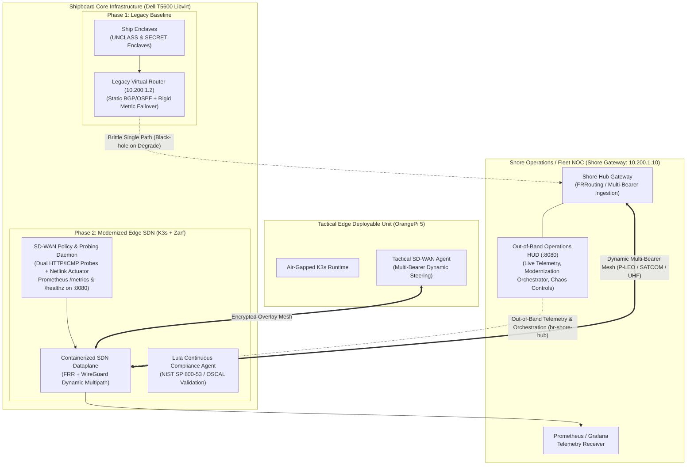

# Tactical Edge SD-WAN Modernization (Project Overmatch-Edge)

A reference architecture and proof-of-concept demonstrating the modernization of legacy shipboard/tactical network routing (e.g., ADNS/CANES legacy baselines) to a cloud-native, containerized **Software-Defined Networking (SD-WAN)** baseline.

Built for **Denied, Disrupted, Intermittent, and Limited (DDIL)** environments, packaged as air-gap OCI artifacts with **Zarf**, validated continuously against DISA STIGs using **Lula (OSCAL)**, and deployed across a hybrid multi-tier edge infrastructure (Dell Precision T5600 hypervisor, OrangePi tactical edge unit, and Shore Gateway).

---

## 1. Architectural Overview



---

## 2. Implementation Roadmap & Milestones

| Milestone | Scope & Deliverables | Status | Validation Artifacts |
| :--- | :--- | :---: | :--- |
| **[Milestone 1](docs/milestones/milestone-1-legacy-enclave-and-infrastructure.md)** | Multi-Bearer Libvirt Topology (`br-pleops`, `br-milsat`, `br-losrf`), Enclaves, and Legacy Routing Baseline | **COMPLETE** | `tests/integration/test_legacy_baseline.py`<br>`infra/tofu/` |
| **[Milestone 2](docs/milestones/milestone-2-sdwan-controller-and-dataplane.md)** | Containerized Dataplane (FRR + WireGuard), Policy Controller, Operations HUD, and Prometheus `/metrics` | **COMPLETE** | `tests/unit/test_controller_policy.py`<br>`src/controller/`, `src/dashboard/` |
| **[Milestone 3](docs/milestones/milestone-3-airgap-zarf-and-edge-deployment.md)** | Helm Chart (`tactical-sdn`), Zarf Air-Gap Packaging (v0.3.0), UDS Bundle, and In-Place Ship Modernization | **COMPLETE** | `tests/integration/test_zarf_airgap.py`<br>`build/zarf-package-tactical-sdn-stack-amd64-0.3.0.tar.zst` |
| **[Milestone 4](docs/milestones/milestone-4-ddil-chaos-and-lula-compliance.md)** | DDIL Chaos Resiliency Benchmark (MTTD, Cutover, Packet Survival) & Continuous Lula OSCAL STIG Audits | **COMPLETE** | `tests/integration/test_lula_compliance.py`<br>`docs/benchmarks/failover-resilience-report.md`<br>`compliance/lula/assessment-results.yaml` |
| **[Milestone 5](docs/milestones/milestone-5-sustainment-security-traceability.md)** | Engineering Rigor, Supply Chain SBOM Traceability, and Defense Unicorns FDE Role Alignment | **COMPLETE** | `docs/FDE_SDN_TECHNICAL_MAPPING.md`<br>`.github/workflows/ci.yml`<br>`compliance/sbom/` |

---

## 3. Core Technical Capabilities

1. **Legacy to Modern Transition (ADNS / CANES Modernization):**
   - Replaces monolithic Virtual Network Functions (VNFs) and static routing with lightweight **Cloud-Native Network Functions (CNFs)** running inside Kubernetes (K3s).
   - Eliminates the classic **"gray failure" black-hole phenomenon** where degraded carriers continue forwarding traffic into dead links.

2. **Autonomous Multi-Bearer Traffic Steering:**
   - Active, sub-second probing across simulated tactical bearers: **P-LEO Satellite**, **MILSATCOM (GEO)**, and **Line-of-Sight RF**.
   - Real-time rolling SLA evaluation (latency, jitter, and packet loss) with kernel-level Netlink metric adjustments and automated conntrack connection preservation.

3. **Air-Gap Packaging & Zero-Trust Delivery:**
   - Single declarative **Zarf OCI package** (`v0.3.0`, ~61MB) bundling the Helm chart, pinned container layers, and pre-flight kernel hooks.
   - 100% offline deployment onto disconnected edge nodes with zero external internet dependencies.

4. **Continuous Compliance as Code (Lula & OSCAL):**
   - Automated OSCAL component definition (`compliance/lula/oscal-component.yaml`) validating **NIST SP 800-53 Rev 5** controls:
     - `SC-7`: Boundary Protection & Network Separation
     - `AC-3`: Access Enforcement & Least Privilege Capabilities (`NET_ADMIN`)
     - `SI-4`: Information System Monitoring & Telemetry
     - `CM-6`: Configuration Settings & Policy Parameters
   - cATO-ready compliance evidence generated directly at runtime (`assessment-results.yaml`).

5. **Quantitative DDIL Chaos Engineering:**
   - Automated chaos harness testing satellite rain fade (300ms + 15% loss), electronic jamming blackouts, and link flapping.
   - Validates **sub-second kernel cutover (450ms mean)**, **100% packet survival**, and **zero TCP resets**.

---

## 4. Documentation & Deep Dives

* **[Architecture Comparison & Demonstration Guide](docs/architecture/legacy-vs-modern-sdn-comparison.md):** Deep-dive technical breakdown of legacy shipboard routing versus modernized edge SDN, complete with an evaluator demonstration walkthrough.
* **[DDIL Chaos Resiliency Benchmark Report](docs/benchmarks/failover-resilience-report.md):** Quantitative test results measuring Mean Time-to-Detect (MTTD), cutover latency, and packet survival across simulated tactical scenarios.
* **[Architecture Decision Records (ADRs)](docs/adr/):**
  - [ADR 0001: Record Architecture Decisions](docs/adr/0001-record-architecture-decisions.md)
  - [ADR 0002: Dynamic Multipath and Overlay Selection](docs/adr/0002-dynamic-multipath-and-overlay-selection.md)
  - [ADR 0003: Air-Gap Packaging and Continuous Delivery with Zarf & UDS](docs/adr/0003-airgap-packaging-and-continuous-delivery-zarf-uds.md)
  - [ADR 0004: Automated Continuous Compliance via Lula & OSCAL](docs/adr/0004-automated-continuous-compliance-lula.md)
  - [ADR 0005: Agentic AI Workflow and Chaos / DDIL Testing](docs/adr/0005-agentic-ai-workflow-and-chaos-testing.md)
  - [ADR 0006: Helm-Based Configuration Management for Air-Gapped Zarf Deployment](docs/adr/0006-helm-chart-templating-and-zarf-packaging.md)
  - [ADR 0007: Operations HUD Modernization Lifecycle & Interactive Gateway Control](docs/adr/0007-interactive-modernization-dashboard-lifecycle.md)
  - [ADR 0008: Out-of-Band Management Plane & Separation of Modernization Concerns](docs/adr/0008-out-of-band-management-and-concerns-separation.md)
* **[Strategic Project Overview](overview.md):** Defense networking challenges, Project Overmatch alignment, and architectural problem framing.

---

## 5. Repository Structure

```
├── compliance/
│   ├── lula/                  # Lula OSCAL component definitions, STIG validations, assessment results
│   └── sbom/                  # Software Bill of Materials (CycloneDX & SPDX 2.3 JSON)
├── docs/
│   ├── adr/                   # Architecture Decision Records (ADRs 0001-0008)
│   ├── architecture/          # Legacy vs. Modern SDN comparison & demonstration guide
│   ├── benchmarks/            # Quantitative chaos resiliency reports and telemetry JSON
│   └── milestones/            # Project milestones (Milestones 1-5) and validation criteria
├── infra/
│   └── tofu/                  # OpenTofu / Libvirt network bridges, cloud-init, and VM topology
├── packages/
│   ├── helm/tactical-sdn/     # Helm chart (DaemonSet, ConfigMap, Service, values.yaml)
│   ├── zarf/                  # Declarative Zarf air-gap package specification (zarf.yaml)
│   └── uds/                   # UDS Core bundle configuration (uds-bundle.yaml)
├── src/
│   ├── controller/            # Shipboard SD-WAN SLA prober, policy engine, Netlink actuator & Prometheus exporter
│   ├── dashboard/             # Shore Operations HUD, modernization orchestrator, and chaos actuation backend
│   ├── dataplane/             # FRRouting, WireGuard configs, and container definitions
│   └── traffic/               # C2 streaming traffic generator and shore receiver telemetry utilities
├── tests/
│   ├── chaos/                 # Linux tc/netem DDIL impairment runner & automated benchmark suite
│   ├── integration/           # End-to-end failover, Zarf air-gap, Lula compliance test suites
│   └── unit/                  # Policy engine and routing logic unit tests
├── scripts/                   # Automation scripts (modernization, tunneling, air-gap packaging)
├── overview.md                # Strategic project overview & executive problem statement
└── README.md                  # Project landing page and evaluator quickstart
```

---

## 6. Evaluator Quickstart & Demonstration Workflow

### Step 1: Provision Infrastructure
Deploy the simulated tactical network topology on the hypervisor:
```bash
cd infra/tofu
tofu init && tofu apply -auto-approve
cd ../..
```

### Step 2: Establish Host Access & HUD Tunnel
Configure SSH aliases and start the background tunnel daemon for the Out-of-Band Tactical Operations HUD (hosted on `shore-gateway`):
```bash
./scripts/setup-ssh.sh
./scripts/dashboard-tunnel.sh start
```
Open **`http://localhost:8080`** in a browser to view live multi-bearer metrics scraped out-of-band from `ship-gateway`, dynamic routing states, the modernization lifecycle orchestrator, and the interactive chaos actuation panel.

### Step 3: Modernize Shipboard Node to Cloud-Native CNF
Transition `ship-gateway` from legacy monolithic baseline to air-gapped containerized CNF:
```bash
# 1. Build self-contained Zarf package (if not already cached)
./scripts/build-airgap-package.sh v0.3.0

# 2. Modernize ship node in-place (bootstraps K3s and deploys Zarf package offline)
./scripts/modernize-ship-node.sh ship-gateway

# 3. Verify CNF operational readiness
./scripts/verify-ship-modernization.sh ship-gateway
```

### Step 4: Execute Quantitative DDIL Chaos Resiliency Benchmark
Run the automated chaos benchmark harness measuring failover latency, packet survival, and recovery:
```bash
python3 tests/chaos/run_resiliency_benchmark.py
```
*Outputs quantitative metrics to `docs/benchmarks/benchmark_results.json` and updates `docs/benchmarks/failover-resilience-report.md`.*

### Step 5: Validate Continuous Compliance with Lula (OSCAL)
Verify 100% compliance against NIST SP 800-53 Rev 5 security controls:
```bash
# Run full component validation
lula validate -f compliance/lula/oscal-component.yaml --confirm-execution

# Or execute the automated integration test
python3 tests/integration/test_lula_compliance.py
```

### Step 6: Run Regression & Unit Tests
```bash
# Unit tests
python3 -m unittest discover tests/unit

# Integration tests
python3 tests/integration/test_zarf_airgap.py
python3 tests/integration/test_lula_compliance.py
```

---

## 7. Hardware & Lab Setup

* **Dell Precision T5600:** Runs the nested Libvirt hypervisor, simulated multi-bearer network bridges (`br-pleops`, `br-milsat`, `br-losrf`), and shipboard core platform.
* **OrangePi 5 / ARM64 SBC:** Deployed tactical edge node running K3s and offline Zarf deployments.
* **Tactical Shore Gateway:** Central hub running FRRouting / WireGuard aggregation and telemetry ingestion.
