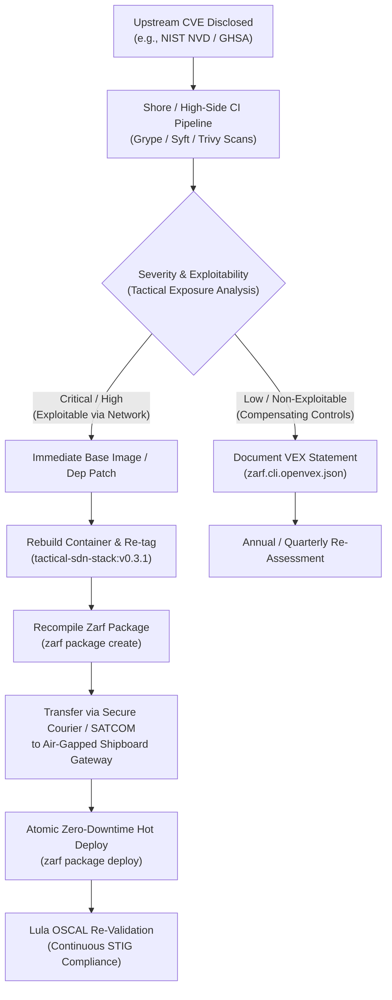

# Air-Gap Vulnerability Management & Software Supply Chain Governance

## 1. Overview & Regulatory Baseline
In defense and tactical edge computing environments operating under **Denied, Disrupted, Intermittent, and Limited (DDIL)** connectivity, traditional cloud-native vulnerability scanners (which rely on live internet queries to NVD, GitHub Advisory Database, or vendor security feeds) are non-viable.

This document establishes the security supply chain governance, Software Bill of Materials (SBOM) generation pipeline, and air-gapped vulnerability triage and remediation protocol for **Project Overmatch-Edge (Tactical Edge SD-WAN)** in accordance with:
- **Executive Order 14028** (*Improving the Nation's Cybersecurity*)
- **NIST SP 800-218** (*Secure Software Development Framework - SSDF*)
- **DISA Application Security and Development STIG**

---

## 2. Software Bill of Materials (SBOM) Architecture

The project produces verifiable, standards-compliant SBOM artifacts in both **CycloneDX** and **SPDX 2.3** formats at build and package time.

### 2.1 Generated SBOM Artifacts
All generated SBOM artifacts are located in [`compliance/sbom/`](file:///home/bjarrett/Projects/tactical-edge-sdn/compliance/sbom/):
1. **CycloneDX JSON (`tactical-sdn-stack-cyclonedx.json`)**: Machine-readable component catalog designed for continuous compliance ingest and OSCAL mapping.
2. **SPDX 2.3 JSON (`tactical-sdn-stack-spdx.json`)**: ISO/IEC 5962:2021 compliant software package bill of materials for federal procurement and supply-chain auditing.
3. **Zarf Air-Gap Package SBOM (`package-sbom/`)**: Embedded directly into the Zarf `.tar.zst` package bundle. Includes the interactive offline HTML viewer (`sbom-viewer-docker.io_library_tactical-sdn-stack_v0.3.0.html`) for disconnected shipboard security officers.

### 2.2 Core Cataloged Dependencies & Cryptographic Baselines
The containerized dataplane and policy engine (`tactical-sdn-stack:v0.3.0`) bundle the following core dependencies:

| Component | Layer / Source | Version | Purpose & Security Role |
| :--- | :--- | :--- | :--- |
| **Linux Kernel WireGuard** | In-tree Kernel Module | Netlink API | Zero-Trust dynamic overlay encryption (`chacha20-poly1305`) |
| **FRRouting (FRR)** | Debian Bullseye Base | 8.4+ | BGP/OSPF dynamic routing daemon with strict metric control |
| **Linux Netlink / PyRoute2** | Python Library | 0.7+ | Kernel FIB route mutation and SLA-driven interface steering |
| **Python Runtime** | Base Image | 3.11-slim | Lightweight policy controller runtime with minimal attack surface |
| **Prometheus Client** | Python Library | 0.17+ | Real-time SLA metrics exposition (`/metrics` on port 8080) |

---

## 3. Disconnected Vulnerability Triage Workflow



### 3.1 Vulnerability Exploitability eXchange (VEX)
Not all common CVEs in general-purpose Linux packages apply to specialized, isolated networking CNFs. When a CVE is flagged in an edge component:
1. **Threat Exposure Review**: Determine if the vulnerable code path is reachable within the locked-down namespace (`tactical-sdn`) and security context (`NET_ADMIN` capability restricted).
2. **VEX Documentation**: Record justifiable false positives or compensating controls in the package VEX statement (`zarf.cli.openvex.json`) with standard justifications (`inline_mitigations_exist`, `vulnerable_code_cannot_be_controlled_by_adversary`).

---

## 4. Air-Gapped Zero-Day Patching Lifecycle

When a critical vulnerability requires remediation in an air-gapped deployment, an FDE applies the **In-Tree Patch Overlay Pattern** (detailed in [`docs/architecture/upstream-archaeology-and-cve-remediation.md`](../docs/architecture/upstream-archaeology-and-cve-remediation.md) and [`compliance/patches/`](patches/)):

1. **High-Side Patch Build & Overlay Verification**:
   Cryptographically verify and apply the backported unified diff patch:
   ```bash
   ./compliance/patches/apply-overlay-patch.sh . check
   ```
   ```bash
   # Rebuild patched container
   docker build -t localhost:5000/tactical-sdn-stack:v0.3.1 -f src/Dockerfile .
   # Rebuild Zarf air-gap package with updated SBOM
   ./scripts/build-airgap-package.sh
   ```

2. **Artifact Verification & Digest Pinning**:
   Inspect the new package and verify its cryptographic SHA256 digest:
   ```bash
   zarf package inspect digest build/zarf-package-tactical-sdn-stack-amd64-0.3.1.tar.zst
   ```

3. **Hot-Patch Rollout to Shipboard Nodes**:
   Transfer the `.tar.zst` via optical media or tactical satellite file burst and deploy hitlessly:
   ```bash
   zarf package deploy build/zarf-package-tactical-sdn-stack-amd64-0.3.1.tar.zst --confirm
   ```
   The Kubernetes RollingUpdate strategy ensures the previous routing pod continues forwarding packets until the patched pod reports ready.

4. **Continuous Compliance Verification**:
   Execute Lula to verify that the upgraded deployment continues satisfying NIST SP 800-53 controls:
   ```bash
   lula validate -f compliance/lula/oscal-component.yaml
   ```
