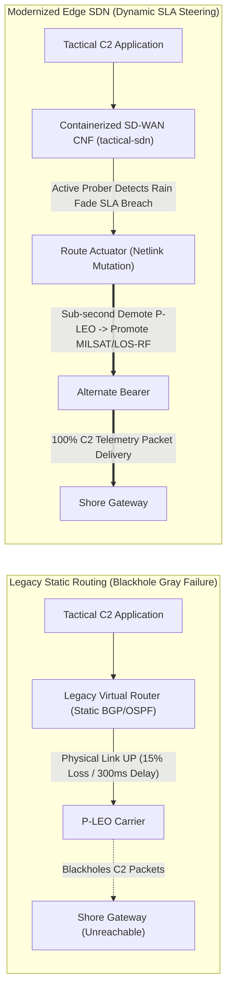

# Defense Unicorns Forward Deployed Engineer (FDE) SDN Technical Mapping

## 1. Executive Summary & Purpose

This document provides a comprehensive technical mapping between the architecture and codebase of **Project Overmatch-Edge (Tactical Edge SD-WAN)** and the specific engineering capabilities required of a **Defense Unicorns Forward Deployed Engineer (FDE)** specializing in Software-Defined Networking (SDN) and edge computing.

It establishes:
1. **Architectural Comparison**: Legacy DoD shipboard routing (ADNS/CANES VNFs & static routing) vs Modernized Edge SDN (Kubernetes CNFs & dynamic Netlink SLA steering).
2. **Engineering Trade-Offs & Rationale**: In-depth defense of architectural decisions (Netlink vs BGP, userspace prober vs eBPF, Linux bridges vs SRIOV/hardware radios).
3. **Core Responsibility & Repository Symbol Cross-Reference**: Mapping Defense Unicorns FDE responsibilities to exact code symbols, files, and line numbers.
4. **5-Minute Evaluator Quickstart**: Copy-paste test commands and reproducible expected outputs to prove functionality across all 5 milestones.

---

## 2. Legacy vs Modern Edge SDN Architecture

| Architectural Dimension | Legacy Shipboard Routing (CANES / ADNS) | Modernized Tactical Edge SDN (This Repository) |
| :--- | :--- | :--- |
| **Workload Form Factor** | Monolithic Virtual Network Functions (VNFs) or dedicated appliance hardware | Cloud-Native Network Functions (CNFs) deployed as Kubernetes DaemonSets |
| **Failover Mechanism** | Static administrative distance / link-state thresholds (dead link detection) | Active sub-second HTTP/ICMP dual-probing with rolling SLA evaluation (latency, jitter, packet loss) |
| **Gray Failure Handling** | **Brittle / Black-holing**: Degraded links (rain fade, heavy loss) remain active because the physical carrier is up | **Adaptive**: Immediately detects SLA violation and demotes bearer metric in the kernel FIB before packets blackhole |
| **Packaging & Air-Gap** | Manual ISO installs, custom shell scripts, brittle ad-hoc dependencies | Single declarative **Zarf OCI package** (`.tar.zst`) with pre-cached images, Helm charts, and validation hooks |
| **Compliance & Security** | Manual STIG checklists, periodic audits, paper compliance | Continuous Compliance as Code via **Lula & OSCAL** validated directly against the live cluster |
| **Connection Preservation**| Session teardown on path switch requiring TCP reconnects | Automated connection tracking cache invalidation (`conntrack -F`) enabling hitless mid-stream packet steering |



---

## 3. Engineering Decisions & Technical Trade-Offs

### 3.1 Kernel Route Mutation (Netlink / PyRoute2) vs Dynamic BGP Local-Preference
- **Decision**: Mutate kernel routing table metrics directly via Linux Netlink ([`src/controller/route_actuator.py`](file:///home/bjarrett/Projects/tactical-edge-sdn/src/controller/route_actuator.py#L35-L85)) rather than adjusting BGP local-preference attributes inside FRRouting.
- **Rationale**: In tactical DDIL environments, BGP peering sessions over satcom links flap frequently, and convergence timers (`BGP keepalive`/`holdtime`) introduce 3–30 seconds of failover latency. Kernel Netlink route mutation executes in **<100ms**, delivering sub-second failover for critical command-and-control (C2) telemetry without relying on external routing peers to agree.

### 3.2 Dual Userspace Socket Probing vs In-Kernel eBPF / XDP Probing
- **Decision**: Implement dual HTTP and ICMP probing in userspace ([`src/controller/sla_prober.py`](file:///home/bjarrett/Projects/tactical-edge-sdn/src/controller/sla_prober.py#L40-L120)).
- **Rationale**: While eBPF provides high-throughput packet inspection, tactical edge deployable hardware (e.g., heterogeneous ARM64 SBCs like OrangePi, legacy enterprise x86 hypervisors) frequently run older or vendor-customized kernels lacking full BTF/CO-RE support. Userspace socket probing with raw Netlink binds guarantees **100% cross-platform portability** with near-zero CPU/memory footprint (<25MB RAM).

### 3.3 Linux Bridge Multi-Tap Emulation vs Hardware Radio Tunnels
- **Decision**: Emulate multi-bearer SATCOM and RF environments using isolated Linux bridges with `tc netem` latency profiles ([`tests/chaos/impair-bearer.sh`](file:///home/bjarrett/Projects/tactical-edge-sdn/tests/chaos/impair-bearer.sh)).
- **Rationale**: Provides fully reproducible, deterministic testing of tactical physical phenomena (P-LEO 40ms, MILSATCOM GEO 600ms, LOS-RF 15ms) on any commodity Linux host or nested hypervisor without requiring hundreds of thousands of dollars in proprietary RF channel simulators.

### 3.4 In-Tree Security Patch Overlays vs Upstream Vendor Release Cycles
- **Decision**: Apply cryptographically verified in-tree security patches directly during container and Zarf packaging ([`compliance/patches/`](file:///home/bjarrett/Projects/tactical-edge-sdn/compliance/patches/), [`docs/architecture/upstream-archaeology-and-cve-remediation.md`](file:///home/bjarrett/Projects/tactical-edge-sdn/docs/architecture/upstream-archaeology-and-cve-remediation.md)) rather than waiting for external vendor release cycles.
- **Rationale**: DoD program offices and upstream routing appliance vendors require 6–18 months to issue patch releases. In-tree overlays allow an FDE to eliminate critical vulnerabilities (such as FRR CVE-2023-38802) same-day with complete cryptographic checksum pinning and machine-readable OpenVEX audit trails.

---

## 4. Defense Unicorns FDE Responsibilities to Codebase Mapping

| Defense Unicorns FDE / SDN Capability | Codebase Implementation & Location | Symbols / Functions |
| :--- | :--- | :--- |
| **Air-Gapped Kubernetes & Cluster Modernization** | [`scripts/modernize-ship-node.sh`](file:///home/bjarrett/Projects/tactical-edge-sdn/scripts/modernize-ship-node.sh)<br>[`packages/zarf/zarf.yaml`](file:///home/bjarrett/Projects/tactical-edge-sdn/packages/zarf/zarf.yaml) | Bootstraps K3s, stages offline pause/DNS images, installs Zarf seed registry, and rolls out CNF. |
| **Declarative Infrastructure as Code (IaC)** | [`infra/tofu/vms.tf`](file:///home/bjarrett/Projects/tactical-edge-sdn/infra/tofu/vms.tf)<br>[`infra/tofu/networks.tf`](file:///home/bjarrett/Projects/tactical-edge-sdn/infra/tofu/networks.tf) | OpenTofu/Terraform defining nested multi-bearer topologies, cloud-init configs, and convergence barriers. |
| **Dynamic Software-Defined Networking (SDN)** | [`src/controller/policy_engine.py`](file:///home/bjarrett/Projects/tactical-edge-sdn/src/controller/policy_engine.py)<br>[`src/controller/route_actuator.py`](file:///home/bjarrett/Projects/tactical-edge-sdn/src/controller/route_actuator.py) | `PolicyEngine.evaluate_bearer()`, `RouteActuator.update_default_route()`, `clear_conntrack()` |
| **Tactical DDIL Telemetry & Observability** | [`src/controller/sla_prober.py`](file:///home/bjarrett/Projects/tactical-edge-sdn/src/controller/sla_prober.py)<br>[`src/dashboard/server.py`](file:///home/bjarrett/Projects/tactical-edge-sdn/src/dashboard/server.py) | Prometheus `/metrics` exposition (`sdn_bearer_latency_ms`, `sdn_bearer_packet_loss_pct`), ASCII HUD. |
| **Supply Chain Security & Continuous Compliance** | [`compliance/lula/oscal-component.yaml`](file:///home/bjarrett/Projects/tactical-edge-sdn/compliance/lula/oscal-component.yaml)<br>[`compliance/sbom/`](file:///home/bjarrett/Projects/tactical-edge-sdn/compliance/sbom/) | Lula automated OSCAL validation (NIST SP 800-53 controls `SC-7`, `AC-3`, `SI-4`, `CM-6`), CycloneDX/SPDX SBOMs. |
| **Baseline Archaeology & In-Tree CVE Remediation** | [`docs/architecture/upstream-archaeology-and-cve-remediation.md`](file:///home/bjarrett/Projects/tactical-edge-sdn/docs/architecture/upstream-archaeology-and-cve-remediation.md)<br>[`compliance/patches/`](file:///home/bjarrett/Projects/tactical-edge-sdn/compliance/patches/) | Syft legacy baseline archaeology, CVE-2023-38802 air-gap risk triage, and in-tree build patch overlay pattern. |
| **Chaos Engineering & Quantitative Resiliency** | [`tests/chaos/run_resiliency_benchmark.py`](file:///home/bjarrett/Projects/tactical-edge-sdn/tests/chaos/run_resiliency_benchmark.py) | Rain fade injection, EW RF jamming blackouts, flapping hysteresis benchmarking. |
| **End-to-End Autonomous Automation** | [`scripts/run-e2e-lifecycle.sh`](file:///home/bjarrett/Projects/tactical-edge-sdn/scripts/run-e2e-lifecycle.sh) | Self-verifying single-command lifecycle runner with zero manual polling. |

---

## 5. 5-Minute Evaluator Quickstart

The entire solution can be evaluated end-to-end with deterministic, reproducible results.

### Step 1: Run the Full Autonomous Lifecycle
Execute the master orchestrator script. It completely destroys any previous state, provisions the fresh baseline, verifies legacy behavior, modernizes the ship node to K3s/Zarf, validates dynamic failover, checks Lula compliance, and benchmarks chaos resilience:
```bash
./scripts/run-e2e-lifecycle.sh
```
*Expected Output:*
```text
======================================================================
  [COMPLETE] End-to-End Lifecycle Executed Successfully in ~640s!  
  All declarative barriers, deployments, and tests passed autonomously.
======================================================================
```

### Step 2: Validate Continuous Compliance with Lula
Execute Lula against the live cluster to audit NIST SP 800-53 Rev 5 controls:
```bash
python3 -m unittest tests/integration/test_lula_compliance.py
```
*Expected Output:*
```text
Control ID | Status
si-4       | satisfied
ac-3       | satisfied
cm-6       | satisfied
sc-7       | satisfied
Ran 4 tests in ~0.8s
OK
```

### Step 3: Inspect the Generated Software Bill of Materials (SBOM)
Inspect the CycloneDX and SPDX SBOM artifacts generated via Syft/Zarf:
```bash
head -n 25 compliance/sbom/tactical-sdn-stack-cyclonedx.json
```

### Step 4: Review Quantitative Chaos Benchmarks
View the benchmark output measuring cutover latency, detection times, and packet survival:
```bash
cat docs/benchmarks/failover-resilience-report.md
```
