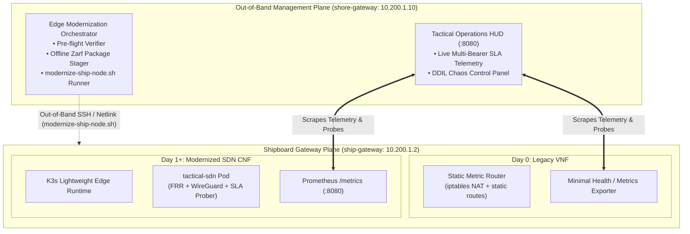

# 8. Out-of-Band Management Plane & Separation of Modernization Concerns

Date: 2026-10-07

## Status
Accepted

## Context
Project Overmatch-Edge demonstrates the modernization of legacy shipboard tactical routing into a cloud-native, containerized Software-Defined Networking (SD-WAN) baseline.

During end-to-end testing of the full lifecycle, an architectural anti-pattern was identified:
1. **Coupling the Management Plane with the Managed Workload ("Surgeon Operating on Their Own Heart"):**
   The Operations HUD and the modernization orchestration logic were embedded directly inside `src.controller.main` running on `ship-gateway`. When transitioning the node from a systemd VNF to a containerized K3s CNF, the node was responsible for orchestrating its own runtime replacement.
2. **Observability Loss & Fragility During Cutover:**
   Because the HTTP server and UI were hosted inside the routing process on `ship-gateway`, any network reconfiguration, interface flapping, or process restart during node cutover introduced the risk of dropping operator visibility and control at the critical moment of modernization.
3. **Violation of Defense / NFV Separation of Concerns:**
   In DoD architectures (such as Navy CANES and ADNS) and ETSI NFV MANO frameworks, the **Workload Plane (Data/Control Plane)** must be strictly decoupled from the **Out-of-Band Management & Orchestration Plane (MANO)**. Core routing workloads should never host web management UIs or orchestrate their own infrastructure lifecycle.

## Decision

We will decouple the system into two distinct planes with clear boundaries:

### 1. Managed Gateway Plane (`ship-gateway` / `10.200.1.2`)
- **Single Responsibility**: Pure networking and dynamic traffic steering.
- **Components**:
  - **Day 0 (Legacy Baseline)**: Static kernel IP forwarding + systemd NAT baseline.
  - **Day 1+ (Modernized Edge SDN)**: Containerized FRRouting + WireGuard mesh + SD-WAN policy prober running as a Kubernetes CNF (`tactical-sdn`).
- **Telemetry Exposure**:
  - Exposes standardized, lightweight endpoints: `/metrics` (Prometheus) and `/healthz` (HTTP probe).
  - Removes all embedded web dashboard servers, static HTML/CSS/JS assets, and self-orchestration scripts from the gateway router.

### 2. Out-of-Band Operations & Modernization Plane (`shore-gateway` / `10.200.1.10`)
- **Single Responsibility**: Out-of-band observability, modernization lifecycle orchestration, and operator control.
- **Location**: Runs on the management backbone (`shore-gateway` on `br-shore-hub` / `10.200.1.10`), completely isolated from tactical carrier link impairments (P-LEO, MILSATCOM, LOS-RF).
- **Components**:
  - **Tactical Operations HUD**: Web dashboard serving the live operational posture, multi-bearer SLA telemetry, and DDIL chaos controls on port 8080.
  - **Modernization Orchestrator Service**: Manages Day 0 $\rightarrow$ Day 2 lifecycle asynchronously:
    - Verifies remote pre-flight node readiness.
    - Stages offline Zarf OCI packages to `ship-gateway` out-of-band.
    - Executes the verified `scripts/modernize-ship-node.sh` workflow.
    - Polls remote health and streams live progress via Server-Sent Events (SSE).
  - **DDIL Chaos Actuator**: Injects netem impairments directly across the multi-bearer bridges.

## Consequences

### Positive
- **Uninterrupted Operator Situational Awareness:** Carrier degradation, interface cutover, and node reboots on `ship-gateway` never interrupt the Operations HUD or drop operator visibility.
- **Architectural Traceability:** Fully aligns with ETSI NFV MANO and DoD CANES/ADNS design patterns, demonstrating defense-grade systems engineering rigor.
- **Reduced Attack Surface & SWaP:** Stripping web assets and deployment tooling out of the shipboard router pod significantly hardens the container image and reduces resource overhead.
- **Realistic Evaluator Experience:** Demonstrates realistic out-of-band edge node lifecycle management rather than synthetic in-band self-orchestration.

### Negative / Trade-Offs
- Requires configuring and managing services across two nodes (`ship-gateway` and `shore-gateway`) rather than packing everything into one monolith.
- `scripts/dashboard-tunnel.sh` must be updated to target `shore-gateway:8080` instead of `ship-gateway:8080`.

## Implementation & Documentation Roadmap
1. Refactor `src/controller/` to expose lightweight `/healthz` and Prometheus `/metrics` without hosting the web UI.
2. Deploy the Operations HUD and Modernization Orchestrator on `shore-gateway`.
3. Update `scripts/dashboard-tunnel.sh` and cloud-init configs to establish the out-of-band management flow.
4. Execute full end-to-end test validation (`test_legacy_baseline.py`, `modernize-ship-node.sh`, `test_sdn_failover.py`, `test_lula_compliance.py`, `run_resiliency_benchmark.py`).
5. Update repository documentation (`README.md`, `docs/architecture/legacy-vs-modern-sdn-comparison.md`, milestone docs) to reflect the new architecture.
