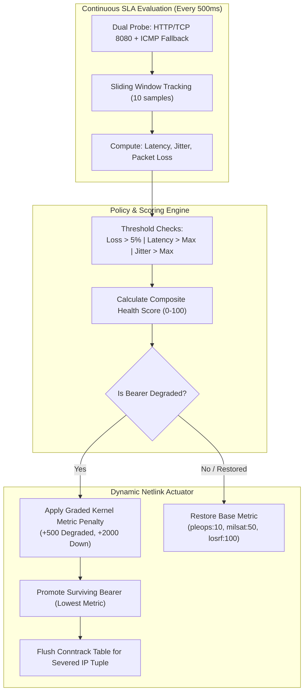

# Architecture Comparison & Demonstration Guide: Legacy Baseline vs. Modernized Edge SDN

## 1. Executive Summary & Framing

In military maritime and expeditionary communications—such as the U.S. Navy's Automated Digital Network System (ADNS) and Consolidated Afloat Networks and Enterprise Services (CANES) baselines—tactical ships navigate **Denied, Disrupted, Intermittent, and Limited (DDIL)** environments while managing diverse satellite and radio communication links.

> [!NOTE]
> **Operational Fidelity & Scope of Emulation:**
> Production shipboard networking systems are sophisticated multi-enclave suites involving baseband modems, cryptographic equipment (e.g., KIV-7M / KG-175 TACLANE), policy-based routing, and dynamic protocols (BGP/OSPF with BFD). However, real-world fleet deployments remain constrained by **heavy VM footprints (VNFs)**, **manual circuit coordination**, **rigid keepalive timers**, and **delays when troubleshooting degraded links**.
>
> For the purposes of this reference architecture and demonstration, our **Legacy Baseline** accurately models the primary operational vulnerability of traditional tactical IP boundaries: **the "Gray Failure" black-hole phenomenon** and **monolithic appliance deployment friction**, contrasting it directly with a **cloud-native, containerized SD-WAN CNF** packaged with **Zarf**.

---

## 2. Architectural Comparison Matrix

| Architectural Vector | Legacy Shipboard Baseline (Modeled) | Modernized Tactical Edge SDN (This Implementation) | Operational Benefit to Fleet & Program Offices |
| :--- | :--- | :--- | :--- |
| **Form Factor & SWaP-C** | **Monolithic VNF / Appliance VM**<br>Tied to dedicated hypervisor sizing, full OS overhead, manual package management. | **Containerized CNF (FRRouting + Netlink Controller)**<br>Runs inside lightweight Kubernetes (K3s), under 128MB RAM footprint. | Enables high-performance routing on low SWaP tactical units (e.g., OrangePi SBCs, unmanned vessels, small combatants). |
| **Failure Detection Model** | **Binary Link Up/Down (Carrier / Keepalive)**<br>As long as the electrical/modem carrier is up, traffic is forwarded regardless of packet degradation. | **Continuous Multi-Dimensional SLA Probing**<br>Evaluates active RTT latency, jitter variance, and packet loss ratio every 500ms using a sliding window. | Eliminates packet loss "black holes" before operators in Radio Central or COMBAT notice degraded C2 feeds. |
| **Failover Mechanism** | **Static Priorities / Manual Intervention**<br>Route fails over only on hard carrier drop or manual CLI metric mutation by watchstanders. | **Automated Dynamic Metric Mutation + Conntrack Flush**<br>Applies graded metric penalties (+500 on degrade, +2000 on cut) and flushes connection tracking states. | Sub-second path steering without requiring TCP session teardowns or stranded UDP NAT bindings. |
| **Air-Gap Delivery & Lifecycle** | **Ad-Hoc Tarballs & Manual OS Patching**<br>Prone to configuration drift, untracked dependencies, and complex field updates. | **Declarative Zarf Air-Gap Packaging**<br>Single 61MB `.tar.zst` archive embedding Helm chart, pinned container layers, and pre-flight hooks. | 100% offline, deterministic deployments across disconnected ships with zero internet or external registry access. |
| **Supply Chain & Accreditation (cATO)** | **Opaque Software Baselines**<br>Manual DISA STIG checklists, slow ATO review cycles, unverified open-source libraries. | **Automated Machine-Readable Compliance**<br>Embedded Syft/CycloneDX SBOMs, Trivy vulnerability audits, and declarative Lula OSCAL validation. | Continuous Authority to Operate (cATO) readiness; instant automated compliance sign-off. |
| **Operational Observability** | **Siloed Logs in `/var/log`**<br>Requires manual SSH / CLI interrogation during link troubleshooting. | **Cloud-Native Metrics & Real-Time HUD**<br>Standard Prometheus `/metrics` exposition on port 8080 and live web dashboard. | Uniform telemetry for Fleet NOCs, shipboard watchstanders, and strike group commanders. |

---

## 3. The Core Failure Mode: "Gray Failures" under DDIL

Traditional routing protocols (like BGP or OSPF) excel at rerouting when a cable is severed or a remote peer powers down. However, tactical maritime links frequently suffer from **partial degradation** rather than clean physical cuts:

1. **Satellite Rain Fade (MILSATCOM / GEO):** Heavy precipitation attenuates microwave frequencies. Signal-to-noise ratio plummets, causing latency to spike from 250ms to 900ms and packet loss to climb to 20-30%.
2. **Electronic Attack / Jamming (P-LEO / RF):** Hostile RF jamming injects high noise floors, resulting in massive burst jitter and packet corruption.
3. **The "Black Hole" Trap:** Because the local modem interface remains electrically linked (`carrier: UP`), standard static routes remain installed in the routing table with default metrics. The router continues shoveling mission-critical tactical data into the failing link, freezing sensor feeds and C2 communications.

### How the Modernized Controller Resolves This



---

## 4. Step-by-Step Demonstration Guide

This walkthrough demonstrates how an evaluator can observe the superiority of the modernized CNF stack using the built-in Tactical Operations HUD and chaos injection harness.

### Step 1: Access the Tactical Operations HUD
Ensure the persistent HUD tunnel is active on the host:
```bash
./scripts/dashboard-tunnel.sh status
```
Open **`http://localhost:8080`** in a browser.

* **Observed Baseline:**
  - **P-LEO:** Metric `10`, State `HEALTHY (Green)` -> **[ACTIVE PRIMARY]**
  - **MILSATCOM:** Metric `50`, State `HEALTHY (Green)`
  - **Tactical LOS-RF:** Metric `100`, State `HEALTHY (Green)`
  - **System Readiness:** `FMC` (Fully Mission Capable)

---

### Step 2: Apply Realistic Multi-Bearer Tactical Profiles
Click **"Apply Tactical Profiles"** on the dashboard (or run `./tests/chaos/impair-bearer.sh apply-profiles`).

* **What Happens:** Realistic satellite orbital delays and RF multipath noise are injected via `tc netem`:
  - `pleops`: 25ms ± 5ms delay, 0.1% loss (Low-Earth Orbit)
  - `milsat`: 250ms ± 25ms delay, 0.5% loss (Geostationary SATCOM)
  - `losrf`: 50ms ± 10ms delay, 1.0% loss (Line-of-Sight RF)
* **Observed Result:** RTT telemetry on the charts reflects real-world physics. Because all links are within acceptable parameters, `pleops` remains the elected primary bearer without false alarms.

---

### Step 3: Inject Electronic Warfare (EW) Jamming on Primary Bearer
Click **"Cut / Jam P-LEO"** on the dashboard (or run `./tests/chaos/impair-bearer.sh cut pleops`).

* **Observed Reaction:**
  1. **Detection:** Within 3-4 seconds, the sliding window detects sustained packet loss crossing the 5% threshold.
  2. **Penalty:** Metric for `pleops` is mutated in the Linux kernel from `10` to `510` (DEGRADED) or `2010` (DOWN).
  3. **Failover:** The controller promotes **MILSATCOM** (metric `50`) as the new primary bearer.
  4. **Conntrack Flush:** The actuator flushes connection tracking states, preventing session lockups.
  5. **Telemetry:** System readiness transitions to `PMC` (Partially Mission Capable).
  6. **Traffic Verification:** Running `ssh enclave-client "ping 10.200.1.10"` shows continuous traffic flow with 0% packet drop arriving over `eth-milsat` on `shore-gateway`.

---

### Step 4: Restore Line Conditions & Observe Hitless Failback
Click **"Restore Clean Baseline"** on the dashboard (or run `./tests/chaos/impair-bearer.sh restore pleops`).

* **Observed Reaction:**
  - Packet loss ceases.
  - As clean probe samples fill the sliding window, the composite health score climbs back to `>99`.
  - The controller resets `pleops` to base metric `10`.
  - Traffic automatically returns to P-LEO as the primary bearer with zero human intervention.

---

## 5. Deployment & Lifecycle Guide: From Legacy to Modernized

This section provides the end-to-end operational instructions to deploy the lab from scratch in its **Legacy Baseline Posture**, access the HUD, and then run the **Modernization Workflow** to transition to the cloud-native CNF stack.

### Phase 1: Deploying the Legacy Baseline (Day 0)

1. **Provision Infrastructure via OpenTofu:**
   The OpenTofu automation provisions the virtual bearer bridges, the 3 VMs (`ship-gateway`, `shore-gateway`, `enclave-client`), and automatically stages the application bundle into `ship-gateway` via cloud-init:
   ```bash
   cd infra/tofu
   tofu init
   tofu apply -auto-approve
   cd ../..
   ```
   *At boot, `ship-gateway` automatically enables and runs the legacy systemd service (`sdwan-controller.service`) directly on the bare VM OS.*

2. **Establish Host Access & Verify Nodes:**
   Run the SSH setup script to configure host aliases in `~/.ssh/config`:
   ```bash
   ./scripts/setup-ssh.sh
   ```
   Verify direct SSH to the nodes:
   ```bash
   ssh ship-gateway "hostname && systemctl is-active sdwan-controller.service"
   # Output:
   # ship-gateway
   # active
   ```

3. **Access the Tactical Operations HUD (Legacy Mode):**
   Start the background tunnel daemon from your workstation:
   ```bash
   ./scripts/dashboard-tunnel.sh start
   ```
   The dashboard tunnel forwards `0.0.0.0:8080` through the hypervisor to `ship-gateway:8080`.
   Open **`http://localhost:8080`** in your browser.
   - **Day 0 Baseline Visualization:** The HUD displays the gateway as `LEGACY ROUTER 10.200.1.2 (VNF)` in amber with the `STAGE 1: DAY 0 BASELINE` stepper active.
   - **Observability:** Telemetry and live link metrics stream directly from the bare VM controller while illustrating gray-failure susceptibility under static routing.

---

### Phase 2: Modernizing the Ship Node (Day 1)

To transition `ship-gateway` from the legacy monolithic VNF architecture to the containerized CNF managed by K3s and Zarf:

1. **Build the Air-Gap Zarf Package (if not already built):**
   ```bash
   ./scripts/build-airgap-package.sh v0.3.0
   ```
   *Outputs `build/zarf-package-tactical-sdn-stack-amd64-0.3.0.tar.zst` containing the Helm chart, container images, and SBOM.*

2. **Execute In-Place Modernization (Interactive HUD or CLI):**
   
   #### Option A: One-Click Modernization via Operations HUD
   In your browser at **`http://localhost:8080`**, utilize the **Modernization Lifecycle Panel**:
   - **Step 1: Bootstrap K3s**: Starts K3s in the background with zero routing downtime for active enclaves.
   - **Step 2: Init Zarf Registry**: Initializes the offline in-cluster seed registry (`zarf-docker-registry`) and mutating webhook agents.
   - **Step 3: Atomic Hot Cutover**: Deploys the containerized SD-WAN CNF DaemonSet and atomically retires the legacy routing service once the pod reports healthy.
   *(Or click **"Full Autonomous Upgrade"** to trigger the complete transition automatically).*

   #### Option B: Automated CLI Modernization Pipeline
   ```bash
   ./scripts/modernize-ship-node.sh ship-gateway
   ```
   *This automated workflow:*
   - Verifies the legacy service remains active while pre-staging binaries, images, and Zarf packages.
   - Bootstraps lightweight Kubernetes (K3s) with local storage enabled.
   - Deploys the self-contained Zarf package (`zarf package deploy`) into the `tactical-sdn` namespace.
   - Atomically cuts over to the containerized CNF and flushes stale connection tracking states.

3. **Verify the Modernized CNF Posture:**
   Run the automated verification test:
   ```bash
   ./scripts/verify-ship-modernization.sh ship-gateway
   ```
   *Confirms:*
   - The `tactical-sdn` DaemonSet pod is `Running` on `ship-gateway`.
   - The `tactical-sdn-telemetry` Kubernetes service is active.
   - Prometheus metrics are scraping live from `http://127.0.0.1:8080/metrics`.
   - Continuous bidirectional traffic is flowing between `enclave-client` and `shore-gateway`.

4. **Access the Tactical Operations HUD (Modernized Mode):**
   The persistent tunnel remains identical:
   ```bash
   ./scripts/dashboard-tunnel.sh status
   ```
   Refresh **`http://localhost:8080`** in your browser.
   - **Modernized Day 2 State:** The HUD topology transforms into `SD-WAN CNF 10.200.1.2 (K3s)` in cyan with `STAGE 4: CLOUD-NATIVE CNF ACTIVE` in green.
   - **Port Consistency:** The containerized CNF inherits host-networking (`hostNetwork: true`), allowing the same port 8080 tunnel to seamlessly serve the HUD without reconfiguring ports or SSH proxies.
   - **Container-Aware Actuation:** Dynamic SLA path steering and chaos injection buttons (Cut P-LEO, Degrade MILSAT, Restore Clean) execute directly inside the container pod using bounded `NET_ADMIN` Linux capabilities.

