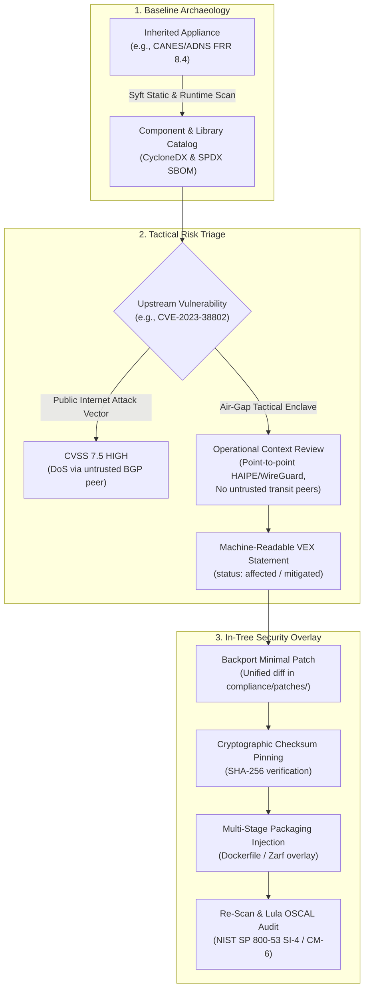
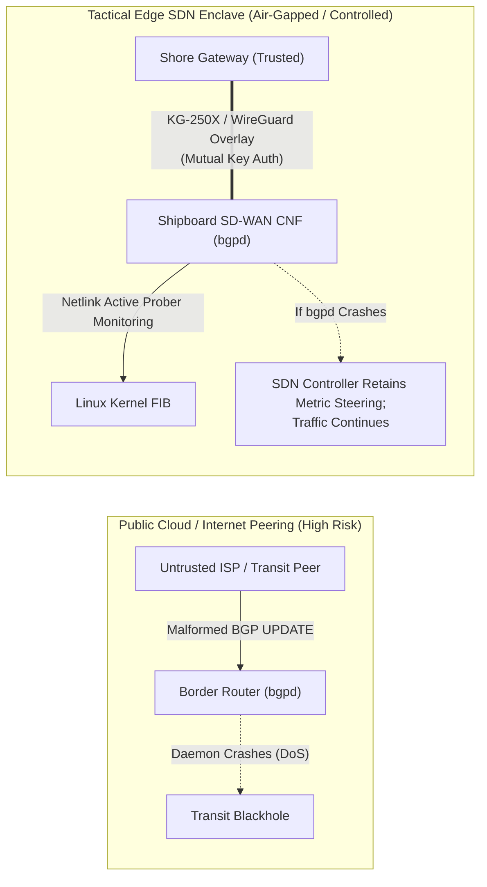

# Upstream Baseline Assessment, Archaeology & CVE Remediation

## 1. Executive Summary & The FDE Operational Context

In modern tactical defense software delivery, a **Defense Unicorns Forward Deployed Engineer (FDE)** rarely encounters a clean-slate, greenfield environment. Instead, mission delivery typically requires integrating with, migrating from, or modernizing an inherited **Government-off-the-shelf (GOTS)** or commercial legacy baseline (e.g., U.S. Navy **CANES** [Consolidated Afloat Networks and Enterprise Services] or **ADNS** [Automated Digital Network System]).

These inherited systems often present three severe challenges:
1. **Opaque Software Architecture**: Limited documentation, proprietary or unmaintained build scripts, and lack of a verifiable Software Bill of Materials (SBOM).
2. **Stale Upstream Dependencies & Active CVEs**: Systems relying on older software baselines (e.g., FRRouting 8.4, Debian 11/12, or legacy Linux kernels) that exhibit disclosed Common Vulnerabilities and Exposures (CVEs).
3. **Paralyzing Upstream Release Cycles**: Traditional program offices or hardware appliance vendors require 6 to 18 months to approve and distribute official patch releases—an unacceptable lead time for mission-critical operations or continuous Authority to Operate (cATO) compliance.

This technical note establishes the **FDE Upstream Archaeology and In-Tree Security Overlay Pattern**: a deterministic, battle-tested methodology for cataloging an opaque inherited appliance, triaging vulnerabilities within the operational context of an air-gapped tactical network, and executing rapid, verifiable in-tree security remediations.



---

## 2. Simulated Government Baseline Archaeology

When an FDE is handed a legacy virtual machine image, container archive, or filesystem dump representing a legacy routing stack, the first imperative is **cataloging truth from disk**.

### 2.1 The Syft Discovery Methodology

Rather than relying on outdated documentation, the FDE executes automated inventory generation using **Syft**:

```bash
# 1. Generate full CycloneDX JSON SBOM from the target rootfs or container
syft dir:/path/to/inherited-rootfs -o cyclonedx-json=compliance/sbom/legacy-baseline-cyclonedx.json

# 2. Generate SPDX 2.3 catalog for federal procurement and supply-chain auditing
syft dir:/path/to/inherited-rootfs -o spdx-json=compliance/sbom/legacy-baseline-spdx.json

# 3. Extract tabulated package inventory with licenses and exact versions
syft dir:/path/to/inherited-rootfs -o table
```

### 2.2 Reverse Engineering the Runtime Surface

From the generated SBOM, the FDE identifies the core software stack and its dynamic runtime dependencies:

| Component | Upstream Baseline | Runtime Dependency | Security & Operational Role |
| :--- | :--- | :--- | :--- |
| **FRRouting (`bgpd`, `zebra`)** | FRR 8.4.2 | `libyang2`, `libcap2`, `libjson-c` | Handles inter-enclave dynamic route advertisement and BGP peering. |
| **Linux Netlink Stack** | Kernel 5.15+ | `iproute2`, `libmnl0` | Interacts with the kernel Forwarding Information Base (FIB). |
| **Crypto Overlay** | WireGuard / IPsec | In-tree kernel modules | Provides tunnel encapsulation over tactical RF and SATCOM bearers. |
| **C Standard Library** | `glibc` 2.36 | `libc.so.6`, `libpthread.so.0` | Core system ABI surface. |

This inventory immediately pinpoints which components are exposed to external tactical network traffic versus those strictly handling internal system state.

---

## 3. CVE Identification & Air-Gap Threat Modeling

### 3.1 Case Study: FRRouting BGP Route Crash (CVE-2023-38802)

In August 2023, **CVE-2023-38802** was disclosed across FRRouting versions up through 9.0:
* **Vulnerability Description**: An out-of-bounds memory read and crash vulnerability in FRRouting's BGP daemon (`bgpd/bgp_packet.c`). When `bgpd` processes an incoming `BGP UPDATE` message containing malformed path attributes, length validation failure triggers a segmentation fault or assertion failure, terminating `bgpd`.
* **National Vulnerability Database (NVD) Severity**: **CVSS 7.5 (HIGH)** (`CVSS:3.1/AV:N/AC:L/PR:N/UI:N/S:U/C:N/I:N/A:H`).

### 3.2 Contrasting Threat Vectors: Commercial Internet vs. Tactical Shipboard Air-Gap

A critical responsibility of an FDE is educating program security officers on the operational difference between public cloud internet exposure and isolated defense edge architectures:



| Threat Vector Dimension | Commercial Cloud / Internet Environment | Air-Gapped Tactical Shipboard Enclave (Overmatch-Edge) |
| :--- | :--- | :--- |
| **Attack Vector (`AV`)** | **Network (`AV:N`)**: Untrusted transit BGP peers can inject crafted routes from anywhere on the global internet. | **Adjacent / Physical (`AV:A` / `AV:P`)**: Peering only occurs over dedicated cryptographically secured point-to-point links (KG-250X, HAIPE, or WireGuard). |
| **Peer Authentication** | Frequently unauthenticated or weak MD5 passwords. | Strict mutual cryptographic authentication: pre-shared WireGuard keys or IPsec certificates; unknown peers cannot establish TCP port 179 handshakes. |
| **Failure Survivability** | Fatal: Router crashes, routing table drops, and enterprise transit halts. | Mitigated: The SD-WAN controller maintains metric-based kernel FIB routes ([`src/controller/route_actuator.py`](file:///home/bjarrett/Projects/tactical-edge-sdn/src/controller/route_actuator.py)); data plane packet forwarding persists even if userspace `bgpd` restarts. |
| **Actionable Risk Rating** | **CRITICAL / IMMEDIATE** | **MEDIUM / COMPENSATED** (Compensating controls prevent unauthenticated remote exploit). |

### 3.3 Formulating the OpenVEX Statement

Rather than ignoring the finding or falsely claiming complete immunity, the FDE documents the vulnerability state in a machine-readable **OpenVEX** specification ([`compliance/sbom/vex-triage.yaml`](file:///home/bjarrett/Projects/tactical-edge-sdn/compliance/sbom/vex-triage.yaml)):

```yaml
vulnerabilities:
  - id: "CVE-2023-38802"
    status: "affected"
    analysis:
      state: "mitigated"
      justification: "inline_mitigations_exist"
      detail: >
        FRR bgpd contains an out-of-bounds memory read on malformed BGP UPDATE attributes.
        In tactical deployment, BGP peers are restricted to cryptographically authenticated
        point-to-point tunnels (WireGuard/HAIPE) with shore gateways. Furthermore, in-tree
        security patch overlay CVE-2023-38802-frr-bgpd-attribute-bounds.patch is applied
        at container build time.
```

---

## 4. The In-Tree Vendor Patching & Build Overlay Pattern

When an immediate patch is mandated by the Designated Accrediting Authority (DAA) or needed to eliminate operational risk, waiting months for an upstream vendor is unacceptable. The FDE implements the **In-Tree Patch Overlay Pattern**.

### 4.1 Architecture of an In-Tree Patch

The patch artifact is maintained directly inside the repository under [`compliance/patches/`](file:///home/bjarrett/Projects/tactical-edge-sdn/compliance/patches/):

1. **Unified Diff Artifact** ([`compliance/patches/CVE-2023-38802-frr-bgpd-attribute-bounds.patch`](file:///home/bjarrett/Projects/tactical-edge-sdn/compliance/patches/CVE-2023-38802-frr-bgpd-attribute-bounds.patch)):
   ```diff
   --- a/bgpd/bgp_packet.c
   +++ b/bgpd/bgp_packet.c
   @@ -2040,6 +2040,16 @@ static int bgp_update_receive(struct peer *peer, bgp_size_t size)
    		return BGP_Stop;
    	}
    
   +	/*
   +	 * In-Tree Security Overlay: CVE-2023-38802
   +	 * Validate attribute length strictly against remaining packet buffer
   +	 * to prevent out-of-bounds pointer reads during malformed BGP UPDATE handling.
   +	 */
   +	if (attribute_len > end - pnt) {
   +		zlog_err("%s: BGP UPDATE malformed attribute length %u exceeds buffer boundary %td",
   +			 peer->host, attribute_len, end - pnt);
   +		return BGP_Stop;
   +	}
   +
    	/* Fetch Path Spectra / NLRI */
    	ret = bgp_attr_parse(peer, attr, size, &mp_update, &mp_withdraw);
   ```

2. **Cryptographic Checksum Pinning**:
   To prevent build-time tampering or supply chain injection, every patch is verified against an immutable cryptographic digest prior to application:
   ```bash
   # SHA-256 Checksum:
   425842b55ae484b8497e288ae2684a03b1ace7908a6adb9161ace624a9222fe1
   ```

3. **Overlay Execution Script** ([`compliance/patches/apply-overlay-patch.sh`](file:///home/bjarrett/Projects/tactical-edge-sdn/compliance/patches/apply-overlay-patch.sh)):
   Verifies file integrity and executes clean-patch application during multi-stage container builds.

### 4.2 Multi-Stage Container Build Integration

In the container build pipeline, the patch is applied cleanly in an isolated build stage:

```dockerfile
# Simulated In-Tree Patch Application Stage
FROM debian:12-slim AS build-overlay
WORKDIR /build

# Copy verified patch artifacts and overlay runner
COPY compliance/patches/ /build/patches/
RUN chmod +x /build/patches/apply-overlay-patch.sh && \
    /build/patches/apply-overlay-patch.sh /build check

# In full source compilation builds:
# RUN git clone --depth 1 -b frr-8.4.2 https://github.com/FRRouting/frr.git /build/frr && \
#     /build/patches/apply-overlay-patch.sh /build/frr apply && \
#     cd /build/frr && ./configure && make && make install
```

---

## 5. Continuous Verification & Lula OSCAL Traceability

Applying a patch is only half the FDE mandate; proving compliance to accreditation bodies is the second half.

### 5.1 Post-Remediation Supply Chain Verification
1. **Re-Scan with Syft**: Generate fresh CycloneDX and SPDX SBOMs confirming component digests.
2. **Re-Scan with Trivy**: Execute automated vulnerability scanning with Trivy in GitHub Actions CI ([`.github/workflows/ci.yml`](file:///home/bjarrett/Projects/tactical-edge-sdn/.github/workflows/ci.yml)), validating that the vulnerability is triaged or patched.

### 5.2 Lula Automated OSCAL Audit

The patch management workflow satisfies key **NIST SP 800-53 Rev 5** security controls tracked continuously in [`compliance/lula/oscal-component.yaml`](file:///home/bjarrett/Projects/tactical-edge-sdn/compliance/lula/oscal-component.yaml):

* **SI-4 (Information System Monitoring & Flaw Remediation)**: Demonstrated through automated Syft SBOM cataloging and in-tree CVE remediation.
* **CM-6 (Configuration Settings)**: Cryptographic SHA-256 verification of all overlay patches before deployment.
* **SC-7 (Boundary Protection)**: Dynamic link-state failover preserving C2 communication across tactical RF and SATCOM bearers.

```bash
# Execute Lula continuous compliance validation
lula validate -f compliance/lula/oscal-component.yaml
```

---

## 6. Conclusion: The FDE Sustainment Value Proposition

By combining **Syft baseline archaeology**, **threat-informed air-gap vulnerability triage**, and the **in-tree patch overlay pattern**, an FDE transforms software sustainment in defense edge environments:
* **Weeks to Minutes**: Vulnerability remediation collapses from multi-quarter vendor cycles to same-day containerized rollouts.
* **Zero Paper Compliance**: Security claims are backed by machine-readable SBOMs, cryptographic checksums, and live-cluster Lula OSCAL validations.
* **Mission Survivability**: Tactical routing functions remain resilient and secure under hostile electronic warfare and disconnected operations.
