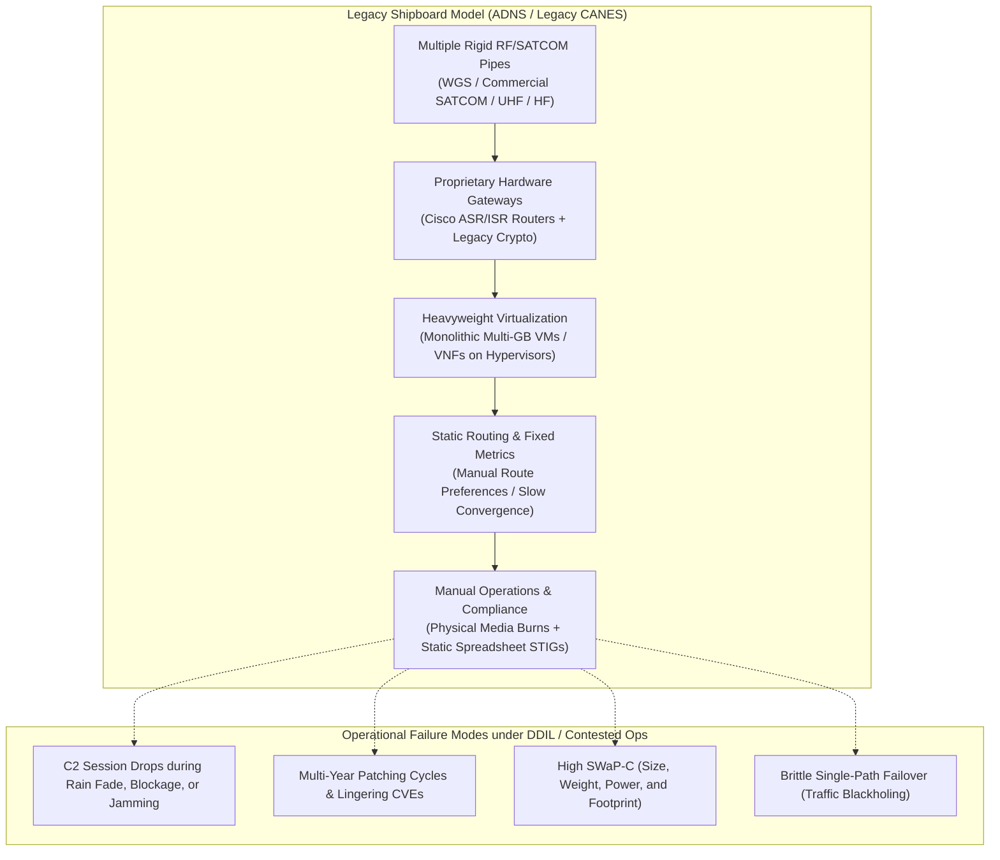
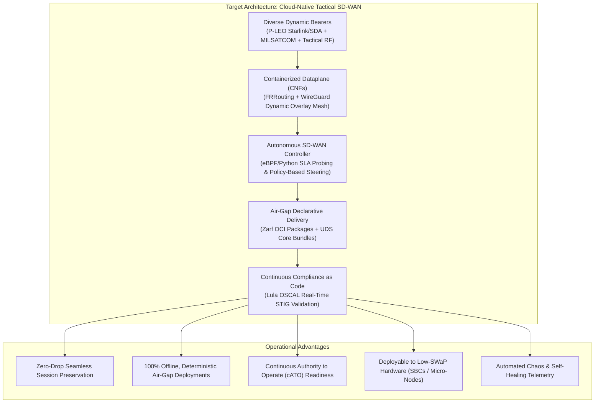

# Project Overview: Tactical Edge SD-WAN Modernization

## 1. Executive Summary & Strategic Impetus

The Department of Defense (DoD) and the U.S. Navy are executing a fundamental modernization of tactical networking architectures. As modern maritime and expeditionary warfare evolves toward distributed, multi-domain operations connecting crewed vessels, unmanned surface/undersea vehicles, and shore command nodes, traditional static networking models have become an operational bottleneck. 

Under strategic initiatives such as the U.S. Navy's **Project Overmatch** and the Pentagon’s broader **Combined Joint All-Domain Command and Control (CJADC2)** mandate, tactical forces require a resilient, automated **"network-of-networks"** capable of operating across heterogeneous, contested, and intermittent communications links.

The overarching goal is to modernize legacy, monolithic shipboard communications infrastructure into an open, containerized, and automated **Software-Defined Wide Area Network (SD-WAN)** baseline. This transition enables dynamic multi-bearer traffic routing, sub-second failover, air-gapped continuous software delivery, and automated compliance accreditation directly at the tactical edge.

This project—**Project Overmatch-Edge**—serves as a working proof-of-concept and technical reference implementation modeling the architectural transitions, engineering challenges, and operational capabilities of this modernized baseline.

---

## 2. The Legacy Problem Space

To understand the necessity of this modernization, one must evaluate the architectural and operational limitations of legacy shipboard communications.

### The Legacy Baseline Challenges:

1. **ADNS (Automated Digital Network System) Constraints:**
   - Historically served as the primary ship-to-shore WAN routing system, constructed around physical rack-mounted router appliances and static metric tables.
   - *Failure Mode:* Traditional routing protocols (static routes or default BGP/OSPF timers) do not measure real-time link performance metrics like latency, jitter, and packet loss. When a satellite connection degrades due to sea-state antenna mast blockage, atmospheric rain fade, or electronic jamming, packets continue to be forwarded to the degraded primary link. By the time routing timers expire, mission-critical Command and Control (C2) TCP sessions have already dropped.

2. **CANES (Consolidated Afloat Networks and Enterprise Services) Legacy Baselines:**
   - Consolidated disparate legacy shipboard enclaves (ISNS, SubLAN, CENTRIXS-M) onto rackmount blade servers and SAN storage running enterprise hypervisors.
   - *Failure Mode:* Network services are packaged as monolithic Virtual Network Functions (VNFs) inside large, multi-gigabyte virtual machine images. Deploying updates or security patches requires burning physical media (DVDs/removable hard drives), transporting them via secure couriers, and manually installing them during scheduled port maintenance. This leads to multi-year patching backlogs and high operational friction.

3. **DDIL (Denied, Disrupted, Intermittent, and Limited) Operational Realities:**
   - Naval and tactical forces operate in environments where internet connectivity cannot be assumed. Radio bearers fluctuate rapidly between high-speed Low-Earth Orbit (P-LEO), high-latency Geostationary SATCOM (GEO MILSATCOM), and tactical Line-of-Sight (LOS) RF. Monolithic software stacks not natively engineered for DDIL conditions fail when confronted with intermittent connectivity, packet loss, and variable bandwidth.

---

## 3. The Target Modernized Solution Architecture

The modern defense networking architecture replaces rigid, hardware-bound appliances with an **open, cloud-native, software-defined edge baseline**:

### Core Modernization Pillars & Technical Solutions:

1. **Transition from VNFs to Containerized Network Functions (CNFs):**
   - Routing, switching, and encryption functions are decoupled from monolithic VMs and refactored into lightweight, standardized OCI containers.
   - Utilizing open routing platforms such as **FRRouting (FRR)** and modern crypto mesh technologies (**WireGuard**) reduces memory and compute footprints by up to 90%, enabling micro-segmentation and rapid restart times.

2. **Autonomous Multi-Bearer Traffic Steering:**
   - Instead of static route metrics, an intelligent SD-WAN policy daemon continuously probes link health (round-trip latency, jitter, loss percentage) across all available physical bearers:
     - **P-LEO Satellite:** Low latency (~40ms), high bandwidth (primary for C2 and rich telemetry).
     - **MILSATCOM (GEO):** High latency (~500ms), resilient fallback.
     - **Tactical LOS RF:** Variable latency, low bandwidth (emissions-controlled tactical comms).
   - Traffic is steered dynamically across the optimal bearer based on traffic classification (e.g., C2 telemetry vs. bulk logistics data) without terminating active user sessions.

3. **Declarative Air-Gap Packaging (Zarf & UDS OCI Standards):**
   - Solves the disconnected deployment challenge by assembling all container images, binary dependencies, configurations, and Helm charts into self-contained, cryptographically signed **Zarf packages** and **UDS bundles**.
   - These packages are deployed deterministically onto disconnected edge nodes (from shipboard hypervisors down to single-board computers) with zero external internet dependencies.

4. **Continuous Compliance as Code (Lula & OSCAL):**
   - Modern defense programs are transitioning from static compliance documentation to **Continuous Authority to Operate (cATO)**.
   - By integrating **Lula** and NIST **OSCAL (Open Security Controls Assessment Language)**, the running cluster continuously validates its own configuration against DISA STIGs (e.g., container security, non-root execution, kernel sysctls), automatically generating machine-readable audit evidence.

5. **Automated Verification & Chaos Engineering:**
   - Network resilience is validated prior to operational deployment through automated chaos engineering harnesses that inject synthetic rain fade, high packet loss, and link flaps via Linux `tc/netem`, confirming automated failover SLAs under realistic operational strain.

---

## 4. Scope of This Reference Implementation (Project Overmatch-Edge)

This repository provides an end-to-end, runnable reference implementation modeling this modernization roadmap:

* **Emulated Multi-Bearer Topology (`infra/tofu/`):** Uses OpenTofu and Libvirt on a lab hypervisor (`t5600`) to create isolated virtual networks modeling P-LEO, MILSATCOM, Line-of-Sight RF, and shipboard security enclaves (UNCLASS and SECRET).
* **Legacy Baseline Emulation:** Deploys a baseline static router demonstrating the exact failure modes (session stalls and blackholing) when a primary link is impaired.
* **Modern Containerized SDN Dataplane (`src/dataplane/`):** Deploys containerized FRR and WireGuard overlays for dynamic multipath routing.
* **Intelligent SD-WAN Policy Controller (`src/controller/`):** Executes real-time link SLA probing and automated route mutation.
* **Air-Gap Packaging (`packages/`):** Encapsulates the entire edge networking suite into declarative Zarf packages for disconnected delivery.
* **Tactical Low-SWaP Edge Deployment:** Verifies deployment onto physical ARM64 tactical hardware (OrangePi 5 running K3s).
* **Automated Chaos Testing & OSCAL Compliance (`tests/`, `compliance/`):** Validates sub-second failover under simulated link degradation and produces automated Lula OSCAL compliance assessments.
